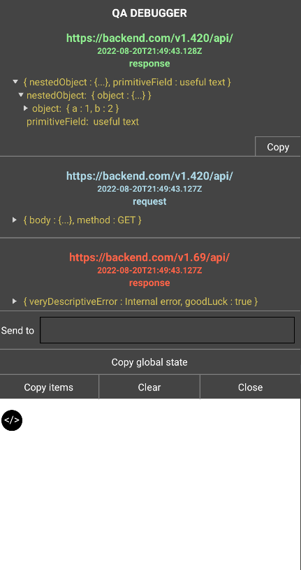

# react-native-qa-debugger

Debugger for QA to help you debug your app and reproducible issues.



## Installation

```sh
npm install react-native-qa-debugger
```

## Usage

```js
import { Debugger, logToDebugger } from 'react-native-qa-debugger';

// top level component

useEffect(() => {
  logToDebugger({
    label: 'App started',
    data: 'Hopefully without a crash',
  });
}, []);

<View style={styles.container}>
  {/* Main app component */}
  <Debugger getGlobalState={getGlobalState} />
</View>
```

### Simple flow

 1. When required press or ask to press the button that you think will provide you desirable context
 2. *Retrieve the data to your device of choice, if required. Online services such as pastebin can help with that
 3. Paste the data to more readable environment such as browser console
 4. Debug

### The flow

 1. Find open API to retrieve the data to. Such as webhook\.site
 2. Use the url acquired, paste it to the "Send to" input and press the button
 3. Copy the data received from the request and go to [github-pages](https://vmagination.github.io/react-native-qa-debugger/) made to help with visualizing and combing the data
 4. Paste the data and Debug

## API Reference

#### &lt;Debugger />

Main component that renders the debugger. *Has to be mounted before logging any items*

<details>

<summary>Props</summary>

  - getGlobalState?: () => Promise\<any> | any; - fn that returns the global state of the app for snapshots and logging. *can be async*
  - disableSnapshots?: boolean; - flag to disable snapshots (might be useful for performance)
  - sendToDefaultValue?: string; - preset input value for sending
  - hideSwitcher?: boolean; - flag to hide the default switcher in case you want to use your own
  - customSendRequest?: (text: string, debugItems: any[]) => void; - custom fn to send a request with debug items
</details>

#### logToDebugger(item)

Function to add item to debugger

<details>

<summary>Item</summary>

- label | title?: string; - label of the item
- logType?: 'info' | 'success' | 'error' | 'warning'; - type of the item for coloring or the actual color code, fallbacks to 'info'
- type?: string; - info text as metadata to be used later for filtering
- data?: any; - actual data of the item

> If no data provided the whole item will be considered as data field

</details>

#### toggleDebugger(toValue?: boolean)

Function to toggle debugger visibility, without toValue it toggles the flag

### Extra utilities for customization

#### &lt;DebuggerSwitcher />

Round button to toggle debugger visibility, for better custom positioning

#### useDebugItems() => [debugItems, logToDebugger]

Function to hook into debug items

#### getCompleteDebugItems(debugItems: any[]) => Promise<any[]>

Function to await snapshots of debug items

#### resetDebugItems()

Function to clear debugger

#### useShowDebugger() => [show, toggleDebugger]

Function to hook into current show state of the debugger
